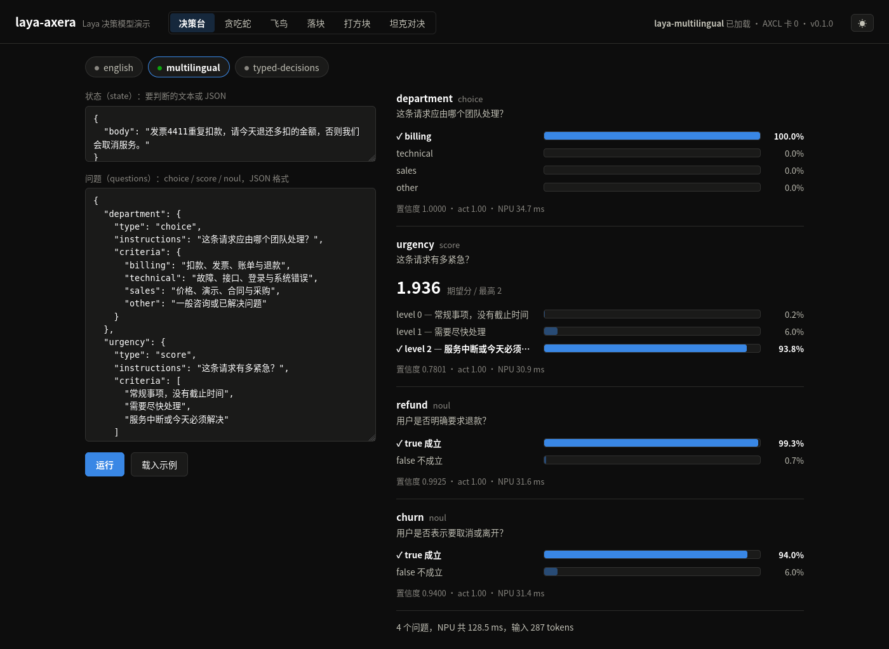
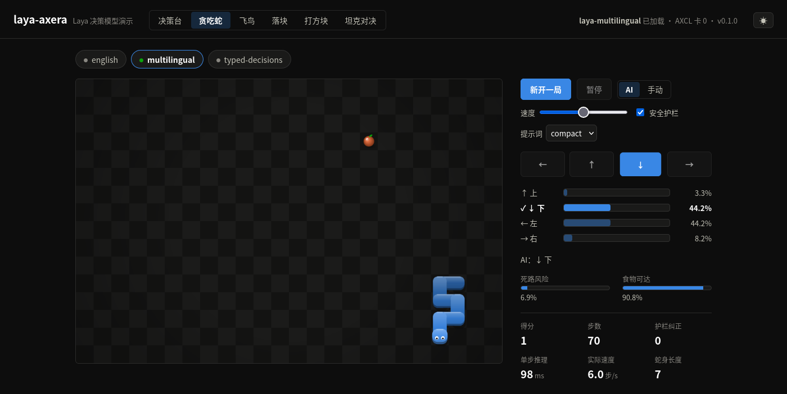
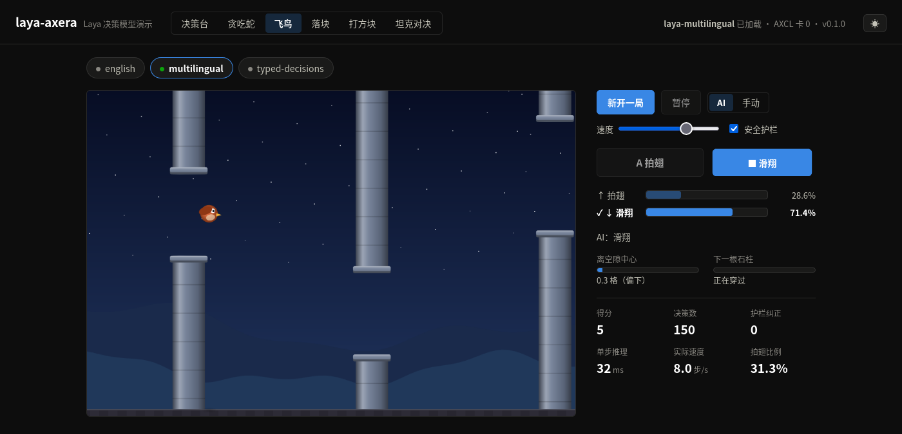
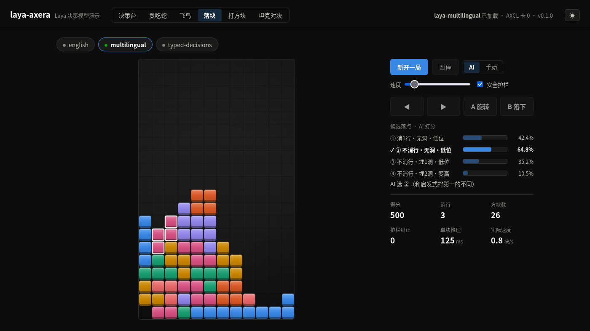
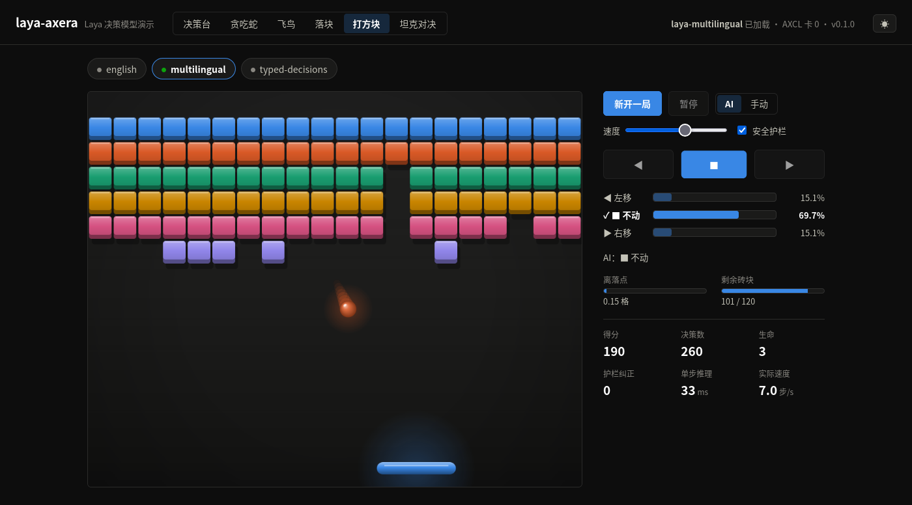
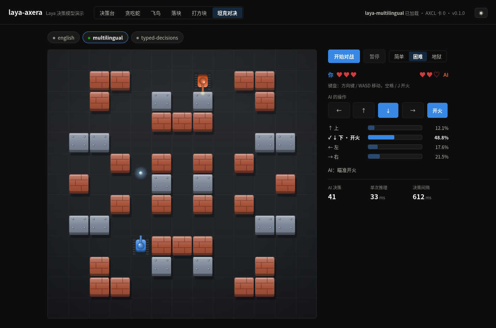

# Laya-AXERA

**Open-weight typed decisions, running on AXERA edge NPUs.**

Python inference for the [AXERA-TECH/Laya](https://huggingface.co/AXERA-TECH/Laya) AXModel
checkpoints through [PyAXEngine](https://github.com/AXERA-TECH/pyaxengine), with a web demo:
a decision playground and five small games, one of them played against you.

**~31 ms** per question with the multilingual checkpoint on one AX8850 (AXCL). **0 output
tokens.** No PyTorch, no Transformers runtime, no cloud API — tokenization uses Hugging
Face's Rust tokenizer and the encoder runs entirely on the NPU.

[中文](README.zh-CN.md) ·
[Model package](https://huggingface.co/AXERA-TECH/Laya) ·
[Upstream Laya](https://github.com/NandhaKishorM/laya) ·
[MLX port this adapts](https://github.com/mizorewww/laya-mlx)

Laya is a bidirectional decision model: it answers constrained questions over text or
structured state in one forward pass, without generating text.

- `choice`: probabilities over 2–4 named options.
- `score`: probabilities over 2–4 ordered rubric levels and their expected score.
- `noul`: P(true) for a proposition.

## Supported platforms

| Platform | Provider | Notes |
|---|---|---|
| AX8850 board (on-chip) | `AxEngineExecutionProvider` | aarch64, NPU3 |
| x86/arm64 host + AXCL card (PCIe / M.2) | `AXCLRTExecutionProvider` | `device_id` picks the card |

The provider is selected automatically; pass `provider=` to force one.

## Install

```bash
git clone https://github.com/AXERA-TECH/laya-axera.git
cd laya-axera
pip install -e '.[web]'
```

PyAXEngine is not on PyPI — install the `axengine` wheel from
[pyaxengine releases](https://github.com/AXERA-TECH/pyaxengine/releases) on the device or
host first. `tokenizers>=0.21` is required to parse the ModernBERT / mmBERT tokenizer files
(the wheel that ships with Transformers 4.41 is too old).

Download the model package (three checkpoints, ~1.5 GiB):

```bash
hf download AXERA-TECH/Laya --local-dir models/Laya
```

| Checkpoint | Backbone | NPU latency per question | Recommended use |
|---|---|---:|---|
| `english/` | ModernBERT-large | ~70 ms on-chip, ~74 ms AXCL | English routing, guardrails, triage |
| `multilingual/` | mmBERT-base | ~28 ms on-chip, ~31 ms AXCL | Chinese and other languages |
| `typed-decisions/` | ModernBERT-large | ~70 ms on-chip, ~74 ms AXCL | Invoice, security, agent-trace workflows |

Latencies measured with `python examples/bench.py <checkpoint>`: on-chip on an AX8850 dev
board (multilingual 28.8 ms, english 71.1 ms, PyAXEngine, models NFS-mounted), AXCL on an
idle x86 host card. The Snake game asks three questions per move, so one move costs about
three question latencies.

## Python API

```python
import laya_axera as laya

agent = laya.load("models/Laya/multilingual")   # device_id=0, provider auto-selected
result = agent.predict(
    "发票4411重复扣款，请今天退还多扣的金额，否则我们会取消服务。",
    {
        "department": {
            "type": "choice",
            "instructions": "这条请求应由哪个团队处理？",
            "criteria": {"billing": "扣款与退款", "technical": "故障报错", "sales": "价格采购"},
        },
        "urgency": {
            "type": "score",
            "instructions": "这条请求有多紧急？",
            "criteria": ["常规", "尽快", "今天必须解决"],
        },
        "refund": {"type": "noul", "instructions": "用户是否明确要求退款？"},
    },
)
print(result["answers"]["department"]["choice"])        # billing
print(result["total_npu_latency_ms"])
```

`system_one` is an alias for `predict`; `predict_request` takes the packaged
`{"state": ..., "questions": ...}` request objects unchanged. States can be text or JSON
records. The answer schema (choice / probabilities / score / legend / noul / confidence /
`action.act_probability`) follows upstream Laya and the packaged `axllm` runtime, plus a
measured `npu_latency_ms` per question.

## CLI

```bash
# one request file (same format as the packaged sample_request.json)
laya-axera run models/Laya/multilingual --input models/Laya/multilingual/sample_request.json

# resident JSON Lines mode: one request per line, /exit stops
laya-axera run models/Laya/multilingual --device 1

# web demo on port 8010, all three checkpoints, lazy-loaded on first use
laya-axera serve --root models/Laya --port 8010
```

## Web demo

`laya-axera serve` hosts six views and a JSON API, all answered by one resident checkpoint.
Each game can be played by the AI or by hand, with the keyboard (arrows or WASD, space to
act) or the on-screen pad. In manual mode the AI still decides every step, and the page shows
whether you agreed with it.

- **决策台 / Decisions**: edit state and questions, run them on the NPU, and read each answer
  as probability bars with its latency. One click loads the checkpoint's validated sample.
- **贪吃蛇 / Snake**: three questions per move (move / risk / food). A deterministic cycle
  shield can correct unsafe moves; every correction is counted.
- **飞鸟 / Bird**: one binary decision per step, flap or glide, through stone pillars whose
  gaps vary in height.
- **落块 / Falling blocks**: a heuristic shortlists four placements and the model rates each
  one independently with a `noul` question; the piece goes where the rating is highest.
- **打方块 / Bricks**: left / right / hold, one question per step. In playtests the model
  tracked the planner on 400 of 400 steps.
- **坦克对决 / Tank duel**: you against the AI in real time. The arena runs in the browser and
  only the AI's moves come from `/api/tank/decide`. Difficulty (简单 / 困难 / 地狱) limits how
  often the AI may decide (every 900 / 450 / 220 ms) and how fast it moves and shoots.

The game wording is chosen by probing the model, not by guesswork. For the tank duel the
labels are compass directions: `right` also means "correct" and pulled probability toward
itself, and a `fire` label did the same, so shooting is a mode of a direction instead. With a
constant state and four fixed option tiers the whole input space is 108 cases; all 108 were
run on the NPU and the model follows the planner in every one.

| Endpoint | Meaning |
|---|---|
| `GET /api/info` | Version, default checkpoint, load status |
| `GET /api/samples/{name}` | Packaged sample request of a checkpoint |
| `POST /api/predict` | `{model?, state, questions}` → answers |
| `POST /api/{snake,bird,blocks,bricks}/new` | `{model?, seed?, guarded?}` → session |
| `POST /api/{snake,bird,bricks}/step` | `{session, action?}` → one step; `action` plays it by hand |
| `POST /api/blocks/step` | `{session}` → one piece placed by the model |
| `POST /api/blocks/place` | `{session, rotation, col}` → your placement, rated against the model's |
| `POST /api/tank/decide` | `{grid, ai, player, bullets}` → the AI tank's next action |

**决策台 / Decisions**



**贪吃蛇 / Snake**



**飞鸟 / Bird**



**落块 / Falling blocks**



**打方块 / Bricks**



**坦克对决 / Tank duel**



## Parity with the board-validated outputs

All three checkpoints reproduce the packaged `sample_output.json` recorded with `axllm` on
an AX8850 board: identical selected labels, and probabilities matching to 4 decimals
(e.g. multilingual: billing 1.0000, urgency 1.9359, refund 0.9925, churn 0.9400).
Run the checks yourself on a device:

```bash
pytest tests/test_common.py tests/test_tank_planner.py       # hardware-free
node tests/js/tank_sim.test.js                                # tank duel simulation
LAYA_AXERA_MODEL_DIR=models/Laya/multilingual pytest tests/   # on NPU
```

## Packaged graph constraints

The AXModels are fixed-shape: batch 1, 256 tokens, up to 4 options, one NPU forward per
question. Longer contexts and batched questions exist upstream but are outside this release.
Probabilities can shift after quantization; validate thresholds on representative data
before automating high-impact actions.

## Acknowledgements and license

Apache-2.0, see [LICENSE](LICENSE) and [NOTICE](NOTICE). Prompt construction, calibration,
result schema and the Snake demo are adapted from [laya-mlx](https://github.com/mizorewww/laya-mlx)
and upstream [Laya](https://github.com/NandhaKishorM/laya) (Convai Innovations). AXModels,
tokenizers and the reference PyAXEngine script are from the
[AXERA-TECH/Laya](https://huggingface.co/AXERA-TECH/Laya) deployment package. Model weights
are downloaded separately and are not included in this repository.
